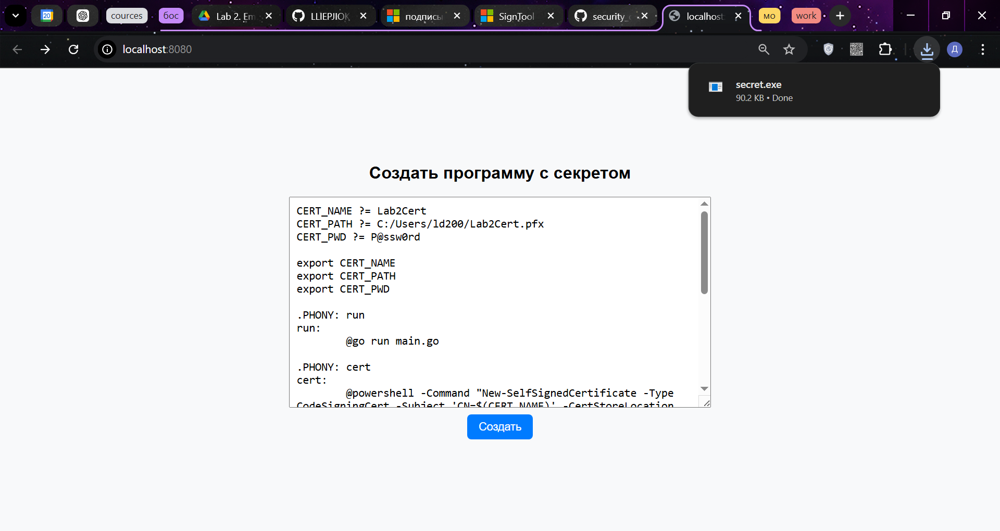
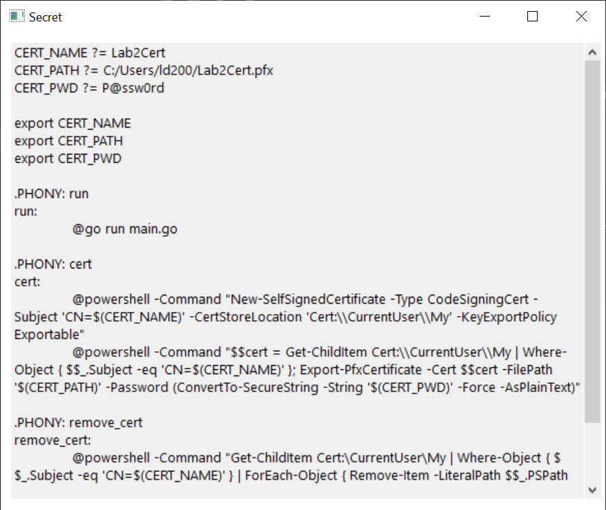
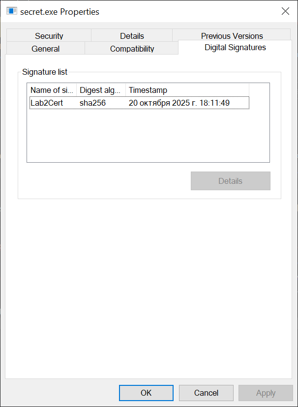

# Отчёт по лабораторной работе №2

_Автор: Лебедев Денис_

## Первая часть

В качестве первой части приложения используется веб сервер на Go, который запускается на [http://localhost:8080](http://localhost:8080). Для UI использовался следующий html код:

```html
<html>
	<head>
		<style>
			body {
				font-family: sans-serif;
				display: flex;
				flex-direction: column;
				align-items: center;
				justify-content: center;
				height: 100vh;
				margin: 0;
				background-color: #f8f9fa;
			}
			form {
				display: flex;
				flex-direction: column;
				align-items: center;
				gap: 10px;
				width: 100%;
				max-width: 600px;
			}
			textarea {
				width: 100%;
				height: 300px;
				font-size: 16px;
				padding: 10px;
				resize: vertical;
			}
			button {
				padding: 8px 16px;
				font-size: 16px;
				cursor: pointer;
				border: none;
				border-radius: 6px;
				background-color: #007bff;
				color: white;
				transition: background-color 0.3s;
			}
			button:hover {
				background-color: #0056b3;
			}
		</style>
	</head>
	<body>
		<h2>Создать программу с секретом</h2>
		<form method="POST" action="/build">
			<textarea name="secret" placeholder="Введите секрет..."></textarea>
			<button type="submit">Создать</button>
		</form>
	</body>
</html>
```

Для генерации подписи использовался сгенерированный самоподписанный сертификат и следующая команда:

```go
signCmd := exec.Command(
	"signtool",
	"sign",
	"/f",
	b.certPath,
	"/p",
	b.certPwd,
	"/fd",
	"SHA256",
	"/tr",
	"http://timestamp.digicert.com",
	"/td",
	"SHA256",
	outFile,
)
if err := signCmd.Run(); err != nil {
	return nil, fmt.Errorf("failed to sign exe: %w", err)
}
```

## Вторая часть

В качестве второй части приложение был написан код на c++, который использует WinAPI для вывода окон:

```cpp
#include <windows.h>

LRESULT CALLBACK WndProc(HWND hwnd, UINT msg, WPARAM wParam, LPARAM lParam)
{
    switch (msg)
    {
        case WM_DESTROY:
        case WM_CLOSE:
            PostQuitMessage(0);
            return 0;
        default:
            return DefWindowProcW(hwnd, msg, wParam, lParam);
    }
}

int WINAPI WinMain(HINSTANCE hInstance, HINSTANCE, LPSTR, int nCmdShow)
{
    const wchar_t* secret = L"{{.Secret}}";

    WNDCLASSW wc = {};
    wc.lpfnWndProc = WndProc;
    wc.hInstance = hInstance;
    wc.lpszClassName = L"SecretWindowClass";
    wc.hCursor = LoadCursor(NULL, IDC_ARROW);
    wc.hbrBackground = (HBRUSH)(COLOR_WINDOW + 1);

    RegisterClassW(&wc);

    HWND hwnd = CreateWindowExW(
        0,
        wc.lpszClassName,
        L"Secret",
        WS_OVERLAPPEDWINDOW | WS_VISIBLE,
        CW_USEDEFAULT, CW_USEDEFAULT, 600, 500,
        NULL, NULL, hInstance, NULL
    );

    HWND hEdit = CreateWindowExW(
        0, L"EDIT", secret,
        WS_CHILD | WS_VISIBLE | WS_VSCROLL | ES_MULTILINE | ES_AUTOVSCROLL | ES_READONLY,
        10, 10, 570, 440,
        hwnd, NULL, hInstance, NULL
    );

    HFONT hFont = CreateFontW(
        18, 0, 0, 0,
        FW_NORMAL, FALSE, FALSE, FALSE,
        DEFAULT_CHARSET,
        OUT_DEFAULT_PRECIS,
        CLIP_DEFAULT_PRECIS,
        CLEARTYPE_QUALITY,
        VARIABLE_PITCH,
        L"Segoe UI"
    );
    SendMessageW(hEdit, WM_SETFONT, (WPARAM)hFont, TRUE);

    MSG msg;
    while (GetMessageW(&msg, NULL, 0, 0))
    {
        TranslateMessage(&msg);
        DispatchMessageW(&msg);
    }

    DeleteObject(hFont);
    return 0;
}
```

## Начало работы

### Предварительные шаги

Необходимо сгенерировать сертификат для последующей подписи. Для этого надо изменить переменные окружения в [Makefile](./Makefile) при необходимости и выполнить следующую команду:

```cmd
make cert
```

Для удаления сертификата можно воспользоваться следующей командой:

```cmd
make remove_cert
```

### Запуск

Для запуска необходимо выполнить следующую команду:

```cmd
make run
```

или cо своими переменными окружения:

```cmd
set CERT_NAME=Lab2Cert
set CERT_PATH=C:/Users/ld200/Lab2Cert.pfx
set CERT_PWD=P@ssw0rd
bin\lebedev_lab2.exe
```

## Демонстрация

Сгенерируем сертификат:

```cmd
C:\Users\ld200\Projects\CPlusPlusProjects\security_os_lab\lebedev_lab2>make remove_cert
Deleted: CN=Lab2Cert
del "C:\Users\ld200\Lab2Cert.pfx"

C:\Users\ld200\Projects\CPlusPlusProjects\security_os_lab\lebedev_lab2>make cert


   PSParentPath: Microsoft.PowerShell.Security\Certificate::CurrentUser\My

Thumbprint                                Subject
----------                                -------
A3CC6490DB1CCA28D281533E4FE06F0C55C125D8  CN=Lab2Cert


    Directory: C:\Users\ld200


Mode                 LastWriteTime         Length Name
----                 -------------         ------ ----
-a----        20.10.2025     18:06           2598 Lab2Cert.pfx
```

Запустим программу:

```cmd
C:\Users\ld200\Projects\CPlusPlusProjects\security_os_lab\lebedev_lab2>make run
2025/10/20 18:07:52 INFO Starting server addr=:8080
```

Откроем [http://localhost:8080](http://localhost:8080) и введём секрет:


Запустим программу и увидим введённый секрет:


Проверим подпись:

