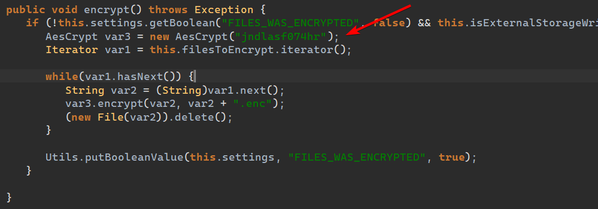
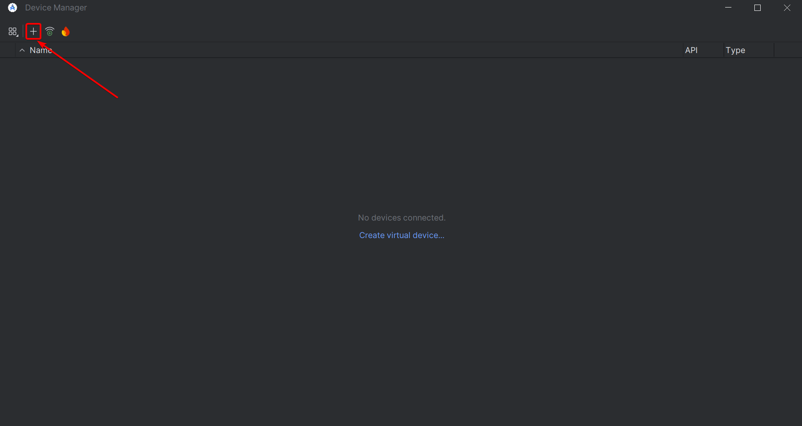
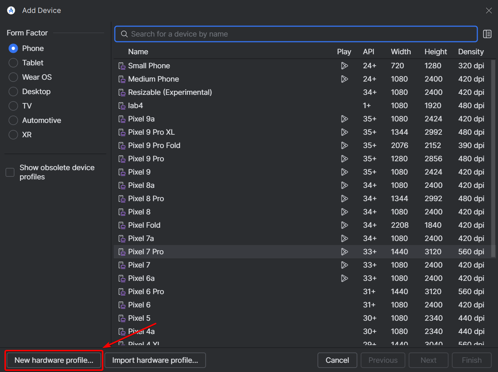
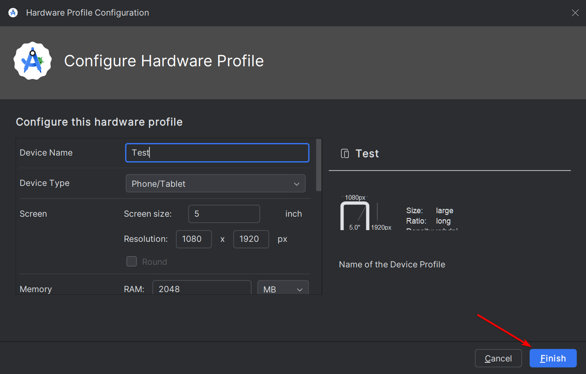
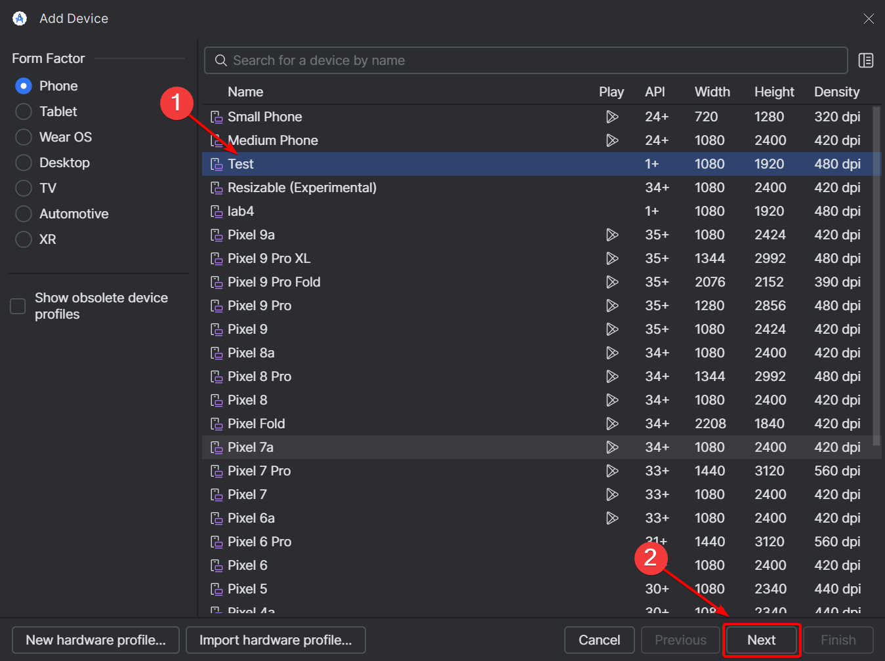
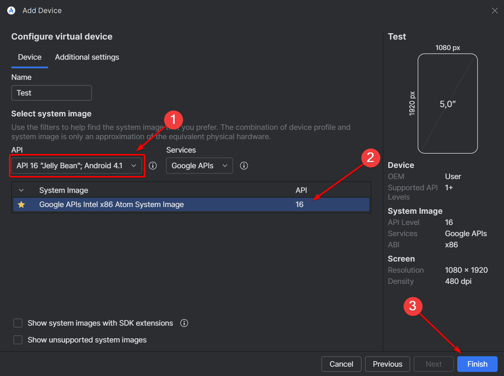
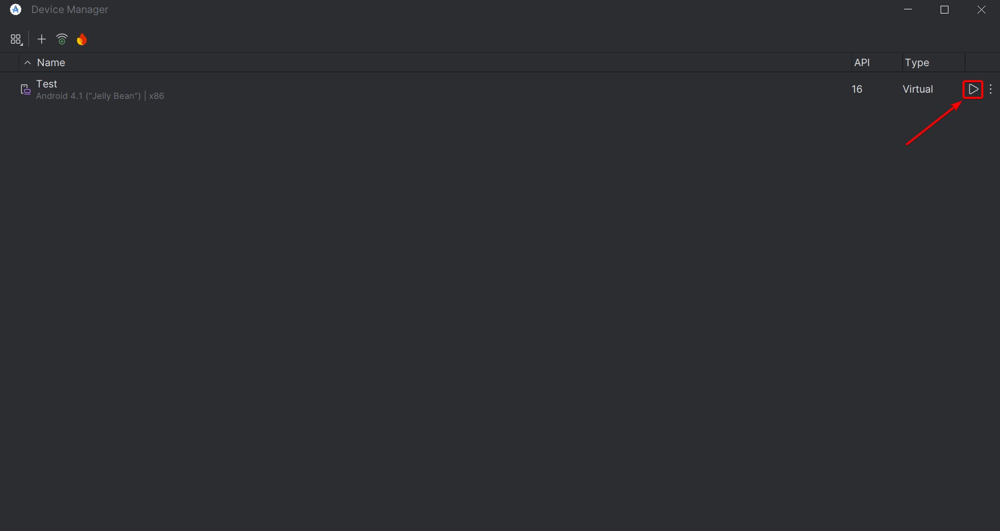
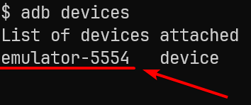

# Отчет по лабораторной работе №4

_Автор: Лебедев Денис_

## Основное задание

Решение основного задания осуществлялось по следующим шагам:

1. Изменение расширения файла `lab_app.apk` на `lab_app.zip`.
2. Извлечение из файла `lab_app.zip` файла `classes.dex`.
3. Открытие файла `classes.dex` в `bytecode viewer`.
4. Поиск алгоритма шифрования в коде приложения:

Поиск осуществлялся по слову `Enc`. Сразу нашёлся class `FilesEncryptor`, который вероятно отвечает за шифрование файлов.
Открыв его, можно увидеть, что используется алгоритм шифрования AES:


Класс `AesCrypt` ищется без труда и реализует алгоритм шифрования AES. Скопировав этот файл, заменив `this.cipher = Cipher.getInstance("AES/CBC/PKCS7Padding");` на `this.cipher = Cipher.getInstance("AES/CBC/PKCS5Padding");` _(так как в Java PKCS7Padding и PKCS5Padding эквивалентны, но PKCS7Padding не поддерживается в стандартной библиотеке Java)_ и добавив секретный ключ `jndlasf074hr` из `FilesEncryptor` получили класс [decryptor](decryptor) для расшифровки файлов.

Запустив его с помощью команды `make test`, получим расшифрованную картинку:


_Note: антивирус на компьютере может удалять исследуемую программу, поэтому может быть необходимо отключить его перед выполнением задания._

## Дополнительное задание

### Код

Идея:

1. Найти и удалить вирус
2. Найти и скачать файлы
3. Расшифровать файлы
4. Вернуть файлы на устройство

Для получения и удаления вирусный файлов эмулятора использовалась утилита `adb`.

За основу алгоритма расшифровки был взят код из основного задания и добавлена возможность работы с директорией. В результате получился такой [дешифратор](android_decryptor).

В итоге получился скрипт [recover.py](recover.py), который выполнял все необходимые действия.

### Настройка эмулятора

В качестве эмулятора была использована [Android Studio](https://developer.android.com/studio).

Настройка эмулятора проходила следующим образом:








### Запуск

Для запуска скрипта необходимо запустить его с помощью команды:

```bash
python recover.py -s emulator-5554
```

где `emulator-5554` - это идентификатор эмулятора, который можно найти с помощью команды `adb devices`:


### Демонстрация

Обычная демонстрация:

[demo-1](images/demo-1.gif)

Демонстрация, что файлы повреждены:

[demo-2](images/demo-2.gif)
